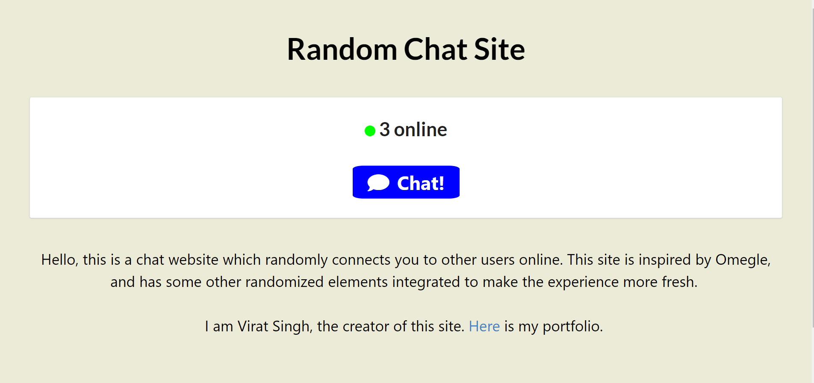
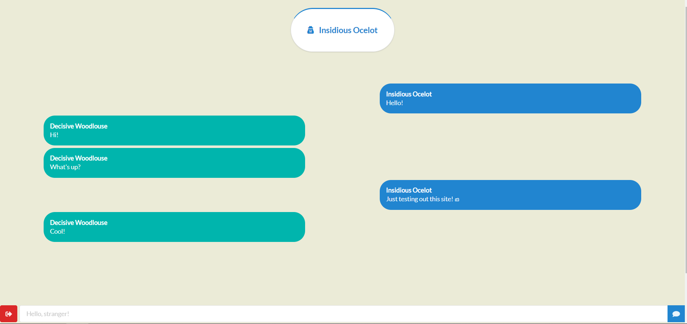

# random-chat
Randomized Chat

This is an Omegle clone where users can connect randomly and anonymously to each other and chat!

Users are given secret code names while talking to still keep a level of personability and also encouraging a conversation starter. Also, a random quote from a giant list is chosen at random while the user is waiting to connect, so the user is not bored.

All chat messages are encrypted on the client side using a random key defined by an affine cipher on the server. As such, all messages are secure.

Finally, there is some bot detection so that the site is not completely flooded with bots.

